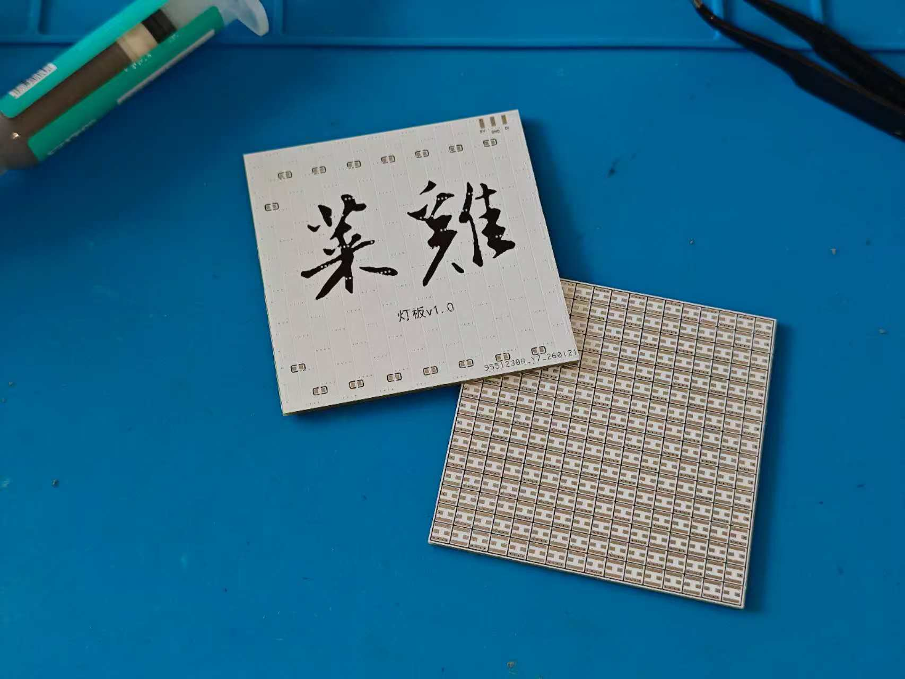
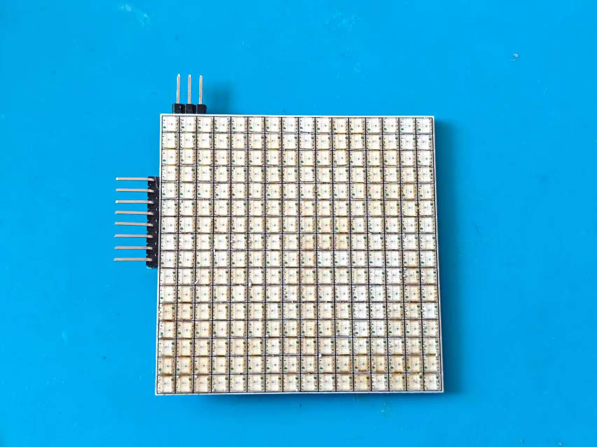
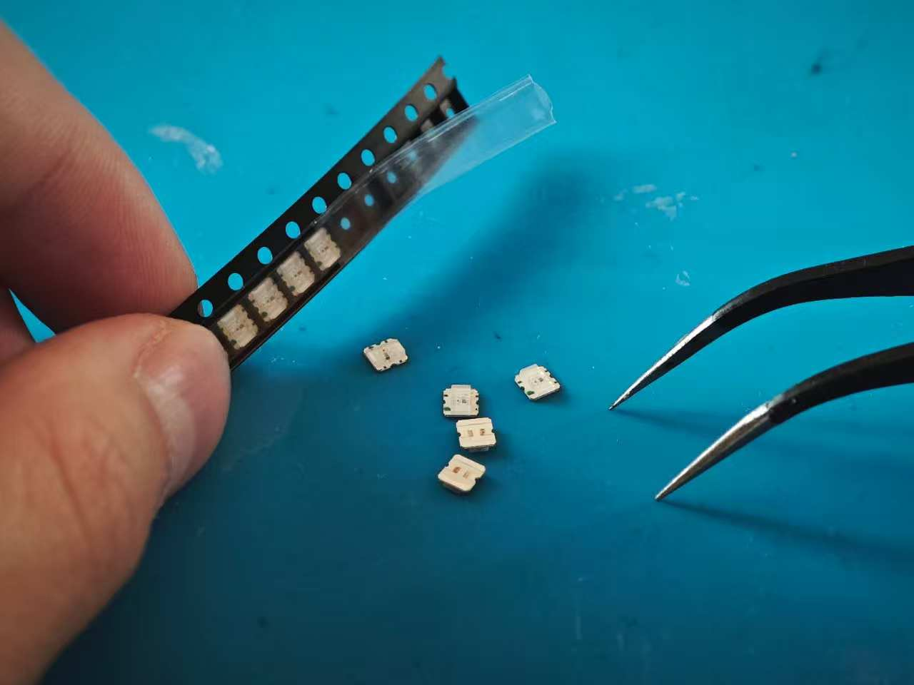
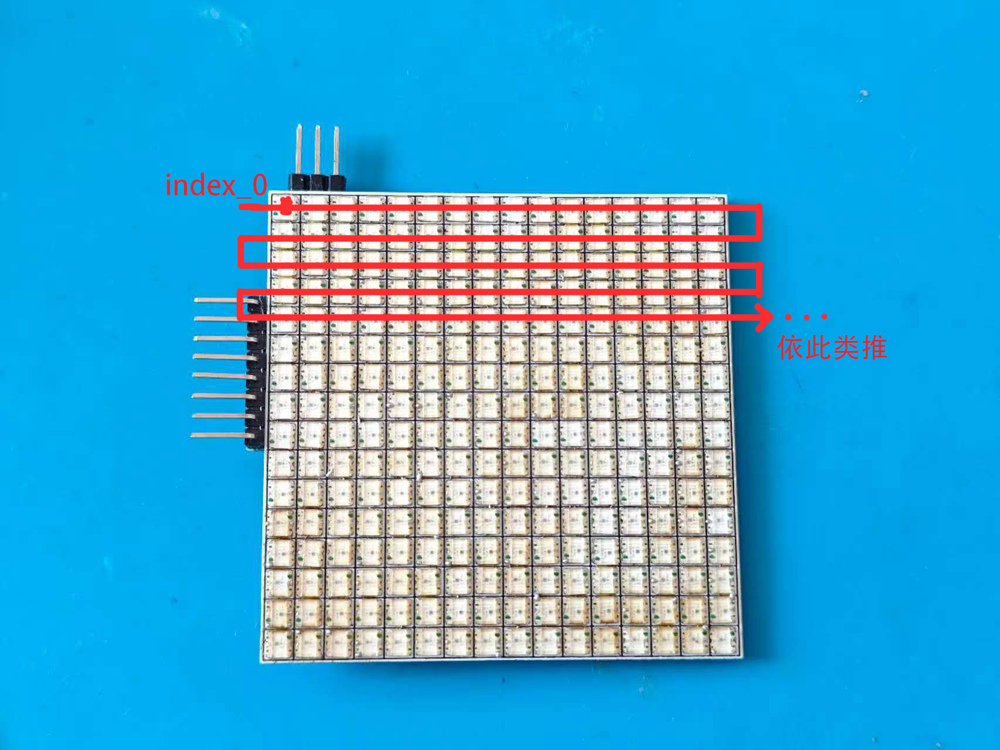
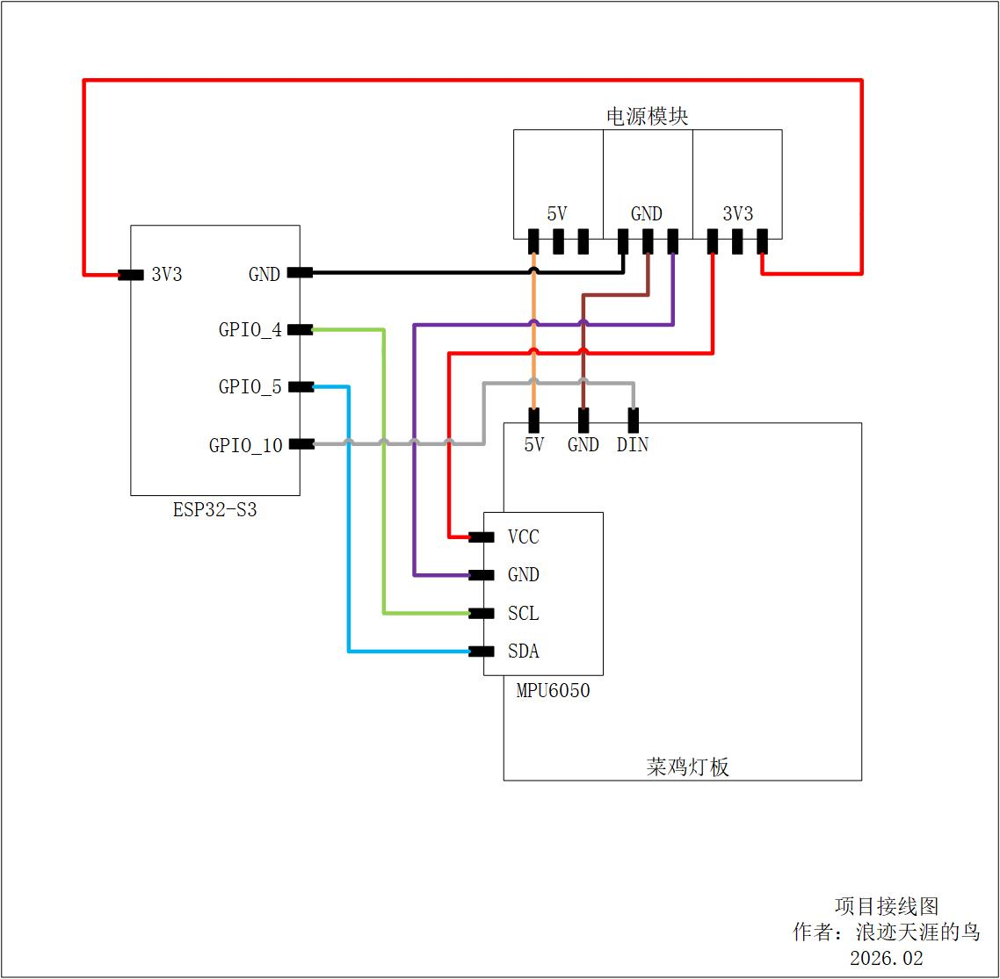
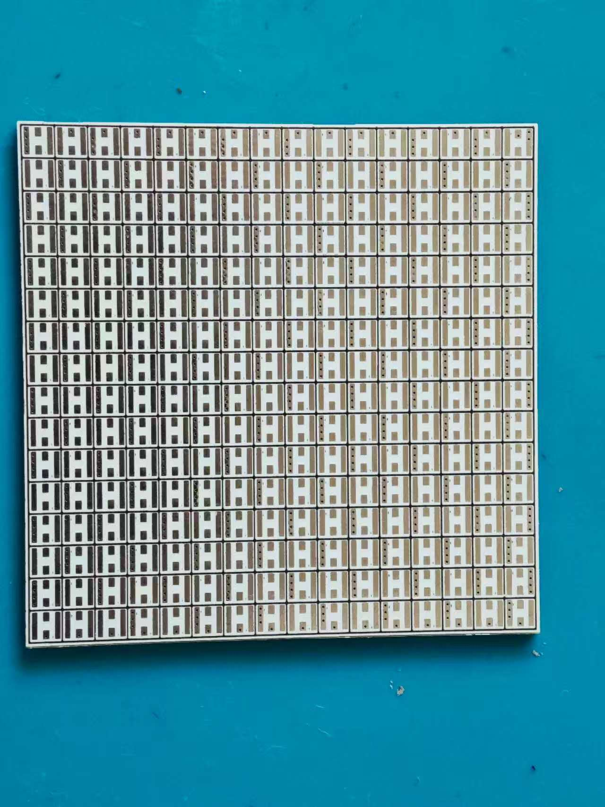
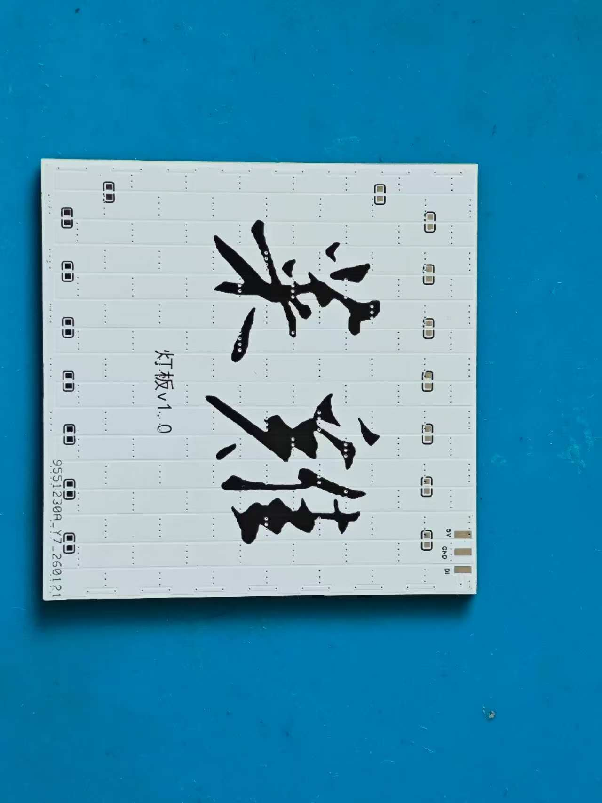

## 项目简介

本项目是一块 16×16 高密度 WS2812 灯板，使用 WS2812B（3332封装） 灯珠组成 256 像素矩阵。灯板本身为纯硬件模块，通过外接 ESP32 等主控从 DIN 输入数据即可驱动显示。演示视频中的“流体水”效果由 Flip 算法在主控端实现，后续将在主控端持续增加更多玩法与功能。

## 项目功能

- 16×16 密集矩阵显示，支持像素级颜色与亮度控制

- 单线级联数据输入（DIN），适配 ESP32/Arduino/ESP-IDF 等驱动方案

- 可实现丰富动画效果（演示视频为 Flip 流体/水波模拟，算法在主控端运行）

## 项目参数

- LED：WS2812B（3332封装）

- 排布：16×16 矩阵，共 256 颗

- 接口：5V / GND / DIN（三线输入）

- 控制方式：单线级联数据（DIN 串行）

- 灯板采用**行优先蛇形走位**：第 0 行从左到右，第 1 行从右到左，依次交替；index=0 为 DIN 输入的第一颗灯。

> 供电建议：WS2812 全白满亮电流较大，建议限亮/限流，并为电源预留充足余量。

## 原理解析（硬件说明）

本灯板主要由 **供电输入、LED 矩阵级联、数据输入** 三部分组成：

1. **供电输入（5V/GND）**  
	通过 5V/GND 给整板供电。  
	- 板上已布置 **16 颗 100nF 去耦电容**（连接 5V 与 GND），用于抑制高频噪声与尖峰。
	- 本板 **未集成入口大电容**（如电解电容）。

2. **LED 矩阵级联（16×16）**
	256 颗 WS2812B 按 16×16 排布，数据逐颗级联（上一颗 DOUT → 下一颗 DIN），形成一条 256 长度的灯链。

3. **数据输入（DIN）**
	主控输出信号接入 DIN，实现整板像素控制。
	- 本板 **未预留 DIN 串联电阻**。

## 软件代码

演示效果（Flip 流体/水波）在主控端实现，代码后续放在 GitHub：

- [GitHub](https://github.com/cccAboy/esp32-led-matrix)：`https://github.com/cccAboy/esp32-led-matrix`

## 接线说明（ESP32 + 灯板 + MPU6050）

### 1) 灯板（WS2812 16×16）

- 灯板 **5V** → 外部电源 5V 
- 灯板 **GND** → 外部电源 GND（必须共地）  
- 灯板 **DIN** → ESP32 **GPIO10**

> 注意：若你使用的是经典 ESP32-WROOM/WROVER，GPIO6~11 通常连接 SPI Flash，GPIO10 可能不可用； 
> 如遇到无法输出或异常，建议把 DIN 改接到常用可用 IO（如 GPIO18/19/23/25/26/27 等，以你实际模组可用 IO 为准）。

### 2) MPU6050 模块  用胶水固定在灯板背面

### 接线表（便于复制）

| 模块    | 引脚 | 连接到       |
| ------- | ---- | ------------ |
| ESP32   | 3V3  | 外部电源 3V3 |
| ESP32   | GND  | 外部电源 GND |
| 灯板    | 5V   | 外部电源 5V  |
| 灯板    | GND  | 外部电源 GND |
| 灯板    | DIN  | ESP32 GPIO10 |
| MPU6050 | SCL  | ESP32 GPIO4  |
| MPU6050 | SDA  | ESP32 GPIO5  |
| MPU6050 | VCC  | 外部电源 3V3 |
| MPU6050 | GND  | 外部电源 GND |

## 注意事项

### 1) 供电与亮度

- 256 颗 WS2812 在**全白高亮**时电流非常大，建议在程序中限制亮度（例如限制全局亮度/最大电流），避免电源压降导致闪烁或花屏。
- 供电线尽量短、尽量粗，地线回路要可靠。

### 2) 电容（本板已做 + 可选外接）

- 本板已布置 **16×100nF 去耦电容**（5V 与 GND 之间）。
- 若出现闪烁/花屏，或使用较长供电线/较高亮度，建议在**灯板 5V 入口附近外接**一颗 **470uF~1000uF 电解电容**（可选），帮助抑制电压波动。

### 3) 信号（DIN，本板未串阻）

- 本板未集成 DIN 串联电阻。短线连接一般可直接使用。
- 若数据线较长或干扰较大，建议在**主控端**给 DIN 串联 **220~470Ω 电阻**（可选），并尽量让 DIN 与 GND 同走、减少干扰。
- 必须保证 **主控与灯板共地（GND 连接）**。

### 4) 接线检查

上电前建议检查：

- 5V/GND 是否反接
- 是否存在明显短路
- 先低亮度点亮测试，再逐步提高亮度

## 组装流程

1. 焊接/贴装 WS2812B 与接口器件

2. 目检与通电前短路检查

3. 将 MPU6050 用胶水固定在灯板背面，并完成 I2C 接线：SCL → GPIO4，SDA → GPIO5

4. 连接 5V/GND/DIN（确保共地，DIN=GPIO10）

5. 先低亮度测试全板点亮，再测试动画/效果 

## 实物图

图1：灯板正面（16×16）

图2：灯板背面/接口位置（5V/GND/DIN）

图3：点亮效果（流体水） 

## 开源协议与商用说明

- 本项目硬件资料采用 **CC BY-NC 3.0** 开源：允许学习、复刻、修改与分享（需署名），**禁止商用**（含生产销售、代工接单、商业项目交付等）。
- 如需商用授权/合作，请联系作者获取单独授权。

 **推荐署名格式**：
 “项目来源：浪迹天涯的鸟/ 项目：ESP32 驱动 WS2812 16×16 灯板 / 许可证：CC BY-NC 3.0”